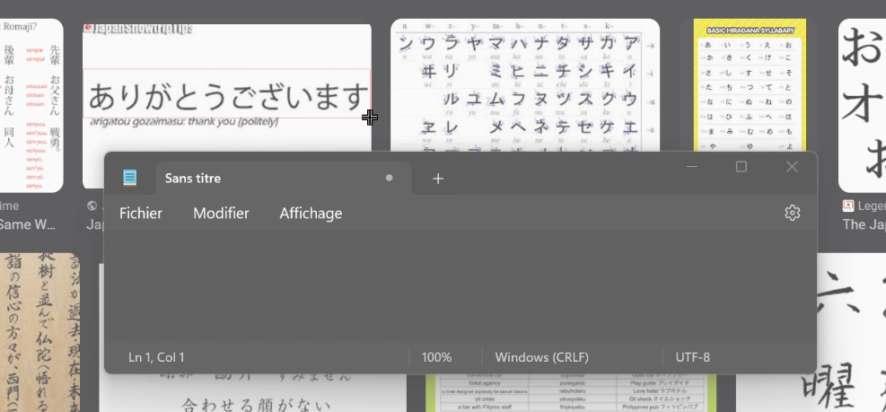
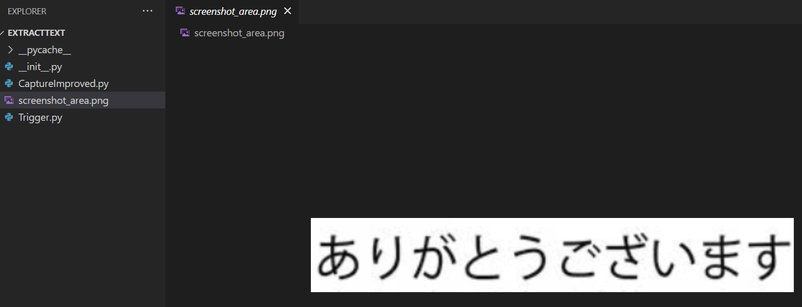
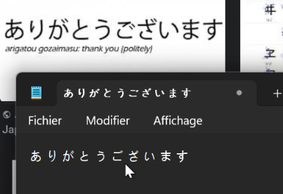

# Trigger Capture & Extract Text

## Use case
Don't understand the language you are seeing on your screen and the text cannot be selected ? 
This tool is to facilitate capturing a selected area of the screen, extracting text from it, and copying that text to the clipboard (so you can then use translation tools).

## Demo :
When running the program, hit "ctrl+shift+f" then can select an area with your mouse :

Then the selected area will be created as an image : 

Then the text on the image will be extracted and store on your clipboad, so then you can paste the text anywhere you want : 

## Usage

Run Trigger.py to start listening for a specific hotkey combination (Ctrl+Shift+F by default).
Press Ctrl+Shift+F to execute the capture and text extraction process.
The text extracted from the selected screen area will be copied to the clipboard.

### CaptureImproved.py
This script handles the actual capture of the screen area.
It utilizes tkinter for creating a GUI to select the screen area.
PyAutoGUI is used for taking the screenshot of the selected area.
Tesseract OCR is employed to extract text from the captured image.

### Requirements
Python 3.x
Required Python packages (keyboard, pynput, pyautogui, tkinter, pytesseract, PIL, pyperclip)
Tesseract OCR should be installed on the system (tesseract_exe path should be configured accordingly)

### Configuration
Ensure Python and the required packages are installed
Set the correct path to Tesseract (tesseract_exe) in CaptureImproved.py.
Modify the hotkey or any other configurations within Trigger.py as needed.
Modify the language targeted according to your needs. For example, if you want to extract japanese characters, you have to have tessdata/jpn.traineddata in your tesseract installation. Then in CaptureImproved.py, change language_target = "jpn"

